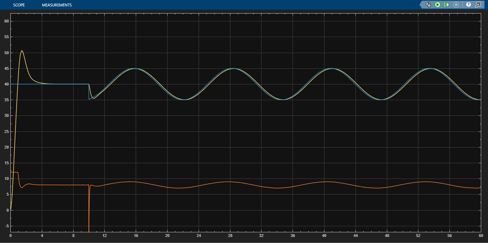

<p align="center">
  
</p>
# DC Motor Speed Control Using a PI + Lead Controller

A simulation-based control systems project focused on the modeling, analysis, and control of a DC motor using MATLAB and Simulink. The project demonstrates the complete engineering workflow from mathematical modeling to controller design, disturbance rejection, robustness analysis, and reference tracking.

---

## Project Overview

The objective of this project was to design a classical feedback controller capable of regulating the angular speed of a DC motor while satisfying practical performance requirements.

The work includes:

- Mathematical modeling of the DC motor
- Open-loop system analysis
- PI controller design
- PI + Lead controller design using the Root Locus method
- Closed-loop performance evaluation
- Disturbance rejection analysis
- Robustness analysis under parameter uncertainties
- Time-varying reference tracking
- Discussion of practical limitations such as actuator saturation

---

## Design Requirements

The controller was designed to satisfy the following specifications:

- Settling time ≈ 2 s
- Overshoot < 5%
- Zero steady-state error for step inputs
- Stable closed-loop poles
- Good disturbance rejection
- Robustness against parameter variations

---

## Tools Used

- MATLAB
- Simulink
- Control System Toolbox
- Root Locus Design
- Classical Control Theory

---

## Project Structure

```
dc-motor-speed-control
│
├── report
│   └── DC_Motor_Control_Report.pdf
│
├── matlab
│   └── final_code.m
│
├── simulink
│   └── dc_motor_control.slx
│
├── images
│   ├── root_locus.png
│   ├── step_response.png
│   ├── disturbance_rejection.png
│   ├── robustness_analysis.png
│   └── sinusoidal_tracking.png
│
└── README.md
```

---

## Results

The final PI + Lead controller achieved:

- Stable closed-loop operation
- Zero steady-state error
- Settling time close to the design target
- Overshoot below 5%
- Successful rejection of moderate load disturbances
- Accurate tracking of slowly varying sinusoidal speed commands
- Robust performance under variations in motor inertia, viscous friction, armature resistance, and torque constant

---

## Disturbance Rejection

The controller successfully compensated for load disturbances of 0.1 N·m and 0.2 N·m while maintaining the desired motor speed.

For larger disturbances (0.4 N·m), performance became limited by the ±12 V actuator saturation rather than by the controller itself. Increasing the available actuator voltage significantly improved the recovery, demonstrating that the observed limitation originated from the physical system rather than from the control algorithm.

---

## Robustness

Robustness was evaluated by modifying several motor parameters:

- +20% Rotor inertia (J)
- +50% Viscous friction coefficient (b)
- -20% Torque constant (Kt)
- +20% Armature resistance (R)

The controller maintained closed-loop stability and continued to satisfy the desired performance with only minor variations in transient response.

---

## Repository Contents

This repository includes:

- MATLAB implementation
- Simulink model
- Complete technical report
- Figures used throughout the report

---

## Future Improvements

Potential extensions of this work include:

- Digital controller implementation
- Anti-windup compensation
- State-space controller design
- Observer-based control
- Experimental validation using a physical DC motor
- Comparison with PID, LQR, and Model Predictive Control (MPC)

---

## Author

**Hussein Issa**

Mechanical Engineering Student  
Al Maaref University

Interested in:
- Control Systems
- Mechatronics
- Robotics
- Mechanical Design
- Automation

LinkedIn:
https://www.linkedin.com/in/hussein-issa-90a560358
